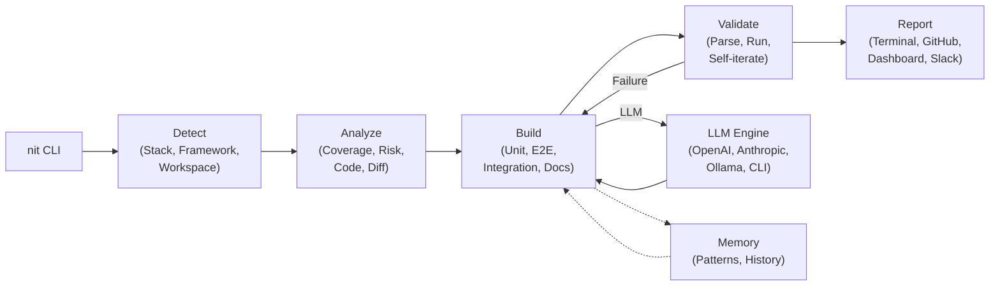

# nit — Never Ignore Tests

### Open-Source AI Testing, Documentation & Quality Agent

[](https://pypi.org/project/getnit/)
[](https://github.com/getnit-dev/nit/actions/workflows/ci.yml)
[](https://www.python.org/downloads/)
[](https://opensource.org/licenses/MIT)

**nit** is a local-first AI quality agent that auto-detects your project's stack and generates comprehensive tests at every level—unit, integration, and E2E—using your existing test frameworks.

---

## Features

- **Auto-detects** your languages, frameworks, and test infrastructure (no config needed)
- **Generates framework-native tests** — Vitest, pytest, Jest, Playwright, and more
- **Self-iterates** — validates generated tests, auto-fixes errors (up to 3 retries per test)
- **Learns your patterns** — analyzes existing tests, matches your project's style and conventions
- **Runs continuously** — CLI for local dev, GitHub Action for PRs, scheduled drift monitoring
- **Coverage-driven** — identifies untested code, undertested functions, and dead zones
- **Self-healing E2E tests** — when UI selectors break, nit updates them automatically
- **LLM drift monitoring** — tracks prompt→output quality over time for AI features
- **Multi-language** — Python, TypeScript/JavaScript, C/C++, Java, Kotlin, Go, Rust, C# (more coming)
- **Monorepo-aware** — supports Turborepo, Nx, pnpm workspaces, Yarn, npm, Cargo, Go modules
- **Parallel execution** — automatic test sharding with AST and LLM response caching
- **Bring your own LLM** — works with OpenAI, Anthropic, Ollama, or any LiteLLM-supported provider

---

## Architecture



---

## Installation

### Via pip (recommended)

```bash
pip install getnit
```

### Via pipx (isolated environment)

```bash
pipx install getnit
```

### From source (for development)

```bash
git clone https://github.com/getnit-dev/nit.git
cd nit
pip install -e ".[dev]"
```

---

## Quickstart

### 1. Initialize nit in your project

```bash
cd your-project/
nit init
```

`nit init` handles everything in one step:
- Detects your languages (Python, TS/JS, C++, Java, Go, Rust, C#)
- Detects test frameworks (pytest, Vitest, Jest, GTest, JUnit, xUnit, etc.)
- Detects workspace tools (Turborepo, Nx, pnpm, Cargo, etc.)
- Walks you through LLM provider setup (OpenAI, Anthropic, Ollama, or any LiteLLM-supported provider)
- Creates `.nit.yml` config and `.nit/profile.json`

Use `nit init --auto` for zero prompts (auto-detect everything with sensible defaults) or `nit init --quick` to accept defaults interactively.

### 2. Run the full pipeline

```bash
nit pick
```

`nit pick` is the main command — it runs the entire quality pipeline end-to-end:

1. **Scan** — analyzes your codebase, identifies untested files, undertested functions, and coverage gaps
2. **Run** — executes your existing test suite using your native test runner
3. **Analyze** — detects bugs, coverage gaps, and high-risk untested code
4. **Generate & Fix** — generates missing tests and fixes for detected bugs, self-iterates on failures
5. **Report** — displays results in your terminal with coverage summaries

Common options:

```bash
nit pick --type unit               # unit tests only
nit pick --type e2e                # E2E tests only
nit pick --target-file src/api.py  # focus on a specific file
nit pick --coverage-target 80      # generate until 80% coverage
nit pick --fix                     # also fix detected bugs
nit pick --auto-commit             # commit generated tests automatically
nit pick --create-pr               # open a PR with the changes
```

### 3. Individual commands

You can also run pipeline stages individually:

```bash
nit scan                   # detect project structure and frameworks
nit run                    # execute test suite with coverage
nit analyze                # find coverage gaps and bugs (no generation)
nit debug --target-file f  # generate and apply bug fixes
nit report --html --serve  # interactive HTML dashboard
```

---

## Documentation, READMEs & Changelogs

nit can generate and maintain project documentation alongside tests.

```bash
nit docs                              # generate docstrings for all files
nit docs --file src/utils/pricing.ts  # docstrings for a specific file
nit docs --check                      # report outdated or missing docs
nit docs --write-to-source            # write docstrings back into source files
```

### README generation

```bash
nit docs --readme              # generate a README based on your project
nit docs --readme --write      # write it to README.md
```

### Changelog generation

```bash
nit docs --changelog v1.2.0                  # generate changelog since tag
nit docs --changelog v1.2.0 --changelog-no-llm  # without LLM summarization
```

---

## Memory & Learning

nit remembers your project's patterns across runs. Memory is stored locally in `.nit/` and includes:

- **Test patterns** — conventions, naming styles, and assertion patterns from your existing tests
- **Failed patterns** — what went wrong in previous generation attempts so nit avoids repeating mistakes
- **Project history** — coverage trends, test execution snapshots, and analytics over time

Memory is enabled by default and can be configured in `.nit.yml`:

```yaml
memory:
  enabled: true
  store_failed_patterns: true
```

---

## LLM Drift Monitoring

If your app uses LLM APIs, nit can monitor output quality over time.

Create `.nit/drift-tests.yml`:

```yaml
drift_tests:
  - name: "Product description generator"
    endpoint: "src/services/ai/generateDescription.ts"
    inputs:
      - prompt: "Write a product description for a wireless mouse"
        expected_traits:
          - contains_keywords: ["wireless", "mouse"]
          - min_length: 50
          - max_length: 200
    comparison: semantic  # semantic | exact | regex | schema
    threshold: 0.85  # cosine similarity threshold for semantic comparison
```

```bash
nit drift              # run all drift tests
nit drift --baseline   # update baselines to current outputs
nit drift --watch      # continuous monitoring
```

---

## Configuration Reference

nit uses `.nit.yml` for configuration. All settings are optional—defaults work for most projects.

### Full example

```yaml
# Project root detection (auto-detected if not specified)
root: .

# LLM configuration
llm:
  provider: openai  # openai | anthropic | ollama | bedrock | vertex_ai | ...
  model: gpt-4o
  api_key: ${OPENAI_API_KEY}  # supports ${ENV_VAR} substitution
  base_url: https://api.openai.com/v1  # optional, for custom endpoints
  max_tokens: 2048
  temperature: 0.2

# Test generation settings
generation:
  max_iterations: 3  # retries per test on failure
  batch_size: 5      # parallel test generation
  skip_existing: true  # don't regenerate existing tests

# Coverage settings
coverage:
  target: 80  # target percentage
  exclude:
    - "**/__pycache__/**"
    - "**/node_modules/**"
    - "**/dist/**"
    - "**/build/**"

# E2E test settings (for Playwright/Cypress)
e2e:
  base_url: http://localhost:3000
  auth:
    strategy: form  # form | oauth | token | cookie | custom
    login_url: /login
    credentials:
      username_field: email
      password_field: password
      username: test@example.com
      password: ${TEST_PASSWORD}
    wait_for: /dashboard  # URL after successful auth

# Monorepo package overrides
packages:
  apps/web:
    llm:
      model: gpt-4o-mini  # cheaper model for frontend tests
  packages/core:
    generation:
      max_iterations: 5  # more retries for critical code

# Memory and learning
memory:
  enabled: true
  store_failed_patterns: true

# Reporting
report:
  format: terminal  # terminal | json | html
  slack_webhook: ${SLACK_WEBHOOK_URL}  # optional Slack notifications
```

### Environment variable substitution

Any config value can reference environment variables:

```yaml
llm:
  api_key: ${OPENAI_API_KEY}
  base_url: ${CUSTOM_LLM_ENDPOINT:-https://api.openai.com/v1}  # with default
```

---

## GitHub Action

Run nit on every PR to ensure new code has tests.

### `.github/workflows/nit.yml`

```yaml
name: nit

on:
  pull_request:
    branches: [main]
  push:
    branches: [main]

jobs:
  test-coverage:
    runs-on: ubuntu-latest
    steps:
      - uses: actions/checkout@v4

      - name: Set up Python
        uses: actions/setup-python@v5
        with:
          python-version: '3.13'

      - name: Install nit
        run: pip install getnit

      - name: Run nit
        env:
          OPENAI_API_KEY: ${{ secrets.OPENAI_API_KEY }}
        run: nit pick --coverage-target 80
```

### PR mode (diff-only testing)

```yaml
- name: Run nit on changed files only
  run: nit generate --diff
```

---

## Supported Languages & Frameworks

### Unit Testing

| Language | Test Frameworks | Coverage Tools |
|---|---|---|
| **TypeScript/JavaScript** | Vitest, Jest, Mocha | Istanbul (c8, nyc) |
| **Python** | pytest, unittest | coverage.py |
| **C/C++** | Google Test, Catch2 | gcov, lcov |
| **Java** | JUnit 5, TestNG | JaCoCo |
| **Go** | go test, testify | go test -cover |
| **Rust** | cargo test | cargo-tarpaulin |
| **C#/.NET** | xUnit | Coverlet |
| **Kotlin** | Kotest, JUnit 5 | JaCoCo |

### E2E Testing

- Playwright (TypeScript/JavaScript)
- Cypress (TypeScript/JavaScript)

### Documentation

- Sphinx (Python)
- TypeDoc (TypeScript)
- JSDoc (JavaScript)
- Doxygen (C/C++)
- rustdoc (Rust)
- godoc (Go)
- MkDocs (Markdown)

---

## Development

### Prerequisites

- Python 3.11+
- pip or pipx

### Setup

```bash
# Clone the repo
git clone https://github.com/getnit-dev/nit.git
cd nit

# Create virtual environment
python -m venv .venv
source .venv/bin/activate  # or `.venv\Scripts\activate` on Windows

# Install in development mode
.venv/bin/pip install -e ".[dev]"
```

### Running Tests

```bash
# Run all tests
.venv/bin/pytest

# Run with coverage
.venv/bin/pytest --cov=src/nit --cov-report=html

# Run specific test file
.venv/bin/pytest tests/test_stack_detector.py
```

### Code Quality (mandatory before committing)

All four must pass with zero errors:

```bash
# 1. Format
.venv/bin/black src/ tests/

# 2. Lint
.venv/bin/ruff check src/ tests/

# 3. Type check
.venv/bin/mypy src/

# 4. Tests
.venv/bin/pytest
```

Or use pre-commit hooks:

```bash
.venv/bin/pre-commit install
.venv/bin/pre-commit run --all-files
```

---

## Contributing

We welcome contributions! Here's how to get started:

### 1. Pick an issue

Browse [open issues](https://github.com/getnit-dev/nit/issues) or create a new one if you have an idea.

### 2. Fork and create a branch

```bash
git checkout -b feature/your-feature-name
```

### 3. Make your changes

Follow the code quality requirements above. All PRs must pass:
- Black formatting
- Ruff linting
- mypy type checking
- pytest tests

### 4. Write tests

All new features must include tests. Aim for >80% coverage.

### 5. Update documentation

If you change user-facing behavior, update the README or docs.

### 6. Submit a PR

Push your branch and open a PR. Describe what you changed and why.

### Building a New Adapter

Want to add support for a new test framework? See [CONTRIBUTING.md](CONTRIBUTING.md) for the adapter development guide.

Example: Adding JUnit 5 support

1. Create `src/nit/adapters/unit/junit5_adapter.py`
2. Implement `TestFrameworkAdapter` interface
3. Add detection logic (check for `pom.xml` or `build.gradle` with JUnit deps)
4. Implement test execution (`mvn test` or `./gradlew test`)
5. Parse test results (JUnit XML or JSON)
6. Write tests in `tests/adapters/unit/test_junit5_adapter.py`
7. Register in `src/nit/adapters/unit/__init__.py`


## FAQ

**Q: Do I need to send my code to a third party?**
No. nit runs entirely locally. You bring your own LLM API key (or use a local model with Ollama).

**Q: Which LLM providers are supported?**
nit uses [LiteLLM](https://github.com/BerriAI/litellm), which supports 100+ providers including OpenAI, Anthropic, Google, AWS Bedrock, Azure OpenAI, and Ollama (local models).

**Q: How much does it cost?**
nit is free and open-source (MIT). You only pay for LLM API usage (~$0.01–0.03 per test). A typical project with 100 untested functions costs $1–3 to reach 80% coverage. Ollama is $0 (runs locally).

**Q: Will nit overwrite my existing tests?**
No. By default, nit only generates tests for untested code.

**Q: Does nit work with monorepos?**
Yes! Supports Turborepo, Nx, pnpm/Yarn/npm workspaces, Cargo workspaces, Go workspaces, Bazel, and more.

---

## Built With

nit is made possible by these amazing open-source projects:

### Core
- [LiteLLM](https://github.com/BerriAI/litellm) — Universal LLM API interface
- [tree-sitter](https://tree-sitter.github.io/tree-sitter/) — Multi-language AST parsing
- [tree-sitter-language-pack](https://github.com/guildai/tree-sitter-language-pack) — Language grammars for tree-sitter
- [Click](https://click.palletsprojects.com/) — CLI framework
- [Rich](https://github.com/Textualize/rich) — Terminal formatting and UI
- [Textual](https://github.com/Textualize/textual) — TUI framework

### Data & Processing
- [PyYAML](https://pyyaml.org/) — YAML configuration parsing
- [sentence-transformers](https://www.sbert.net/) — Semantic embeddings for drift detection
- [defusedxml](https://github.com/tiran/defusedxml) — Secure XML parsing
- [httpx](https://www.python-httpx.org/) — Async HTTP client
- [Requests](https://requests.readthedocs.io/) — HTTP client
- [jsonschema](https://python-jsonschema.readthedocs.io/) — JSON schema validation

### Observability
- [Sentry SDK](https://docs.sentry.io/platforms/python/) — Error tracking and telemetry

### Documentation
- [MkDocs](https://www.mkdocs.org/) — Static site generator for documentation
- [Material for MkDocs](https://squidfunk.github.io/mkdocs-material/) — Documentation theme with search, dark mode, and navigation

### Development Tools
- [pytest](https://pytest.org/) — Testing framework
- [pytest-asyncio](https://github.com/pytest-dev/pytest-asyncio) — Async test support
- [pytest-cov](https://github.com/pytest-dev/pytest-cov) — Test coverage plugin
- [Black](https://black.readthedocs.io/) — Code formatter
- [Ruff](https://docs.astral.sh/ruff/) — Fast Python linter
- [mypy](https://mypy.readthedocs.io/) — Static type checker
- [pre-commit](https://pre-commit.com/) — Git hook manager
- [Hatchling](https://hatch.pypa.io/) — Build backend

---

## License

[MIT](LICENSE) © nit contributors

---

## Links

- **Homepage**: [https://getnit.dev](https://getnit.dev)
- **GitHub**: [https://github.com/getnit-dev/nit](https://github.com/getnit-dev/nit)
- **PyPI**: [https://pypi.org/project/getnit/](https://pypi.org/project/getnit/)
- **Documentation**: [https://docs.getnit.dev](https://docs.getnit.dev)
- **Issues**: [https://github.com/getnit-dev/nit/issues](https://github.com/getnit-dev/nit/issues)

---

**Built with ❤️ by the nit community**
